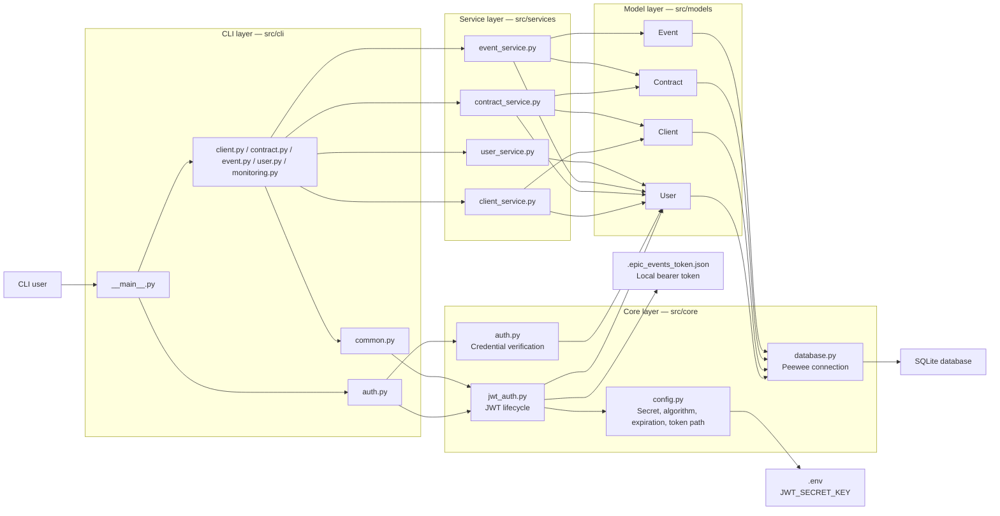
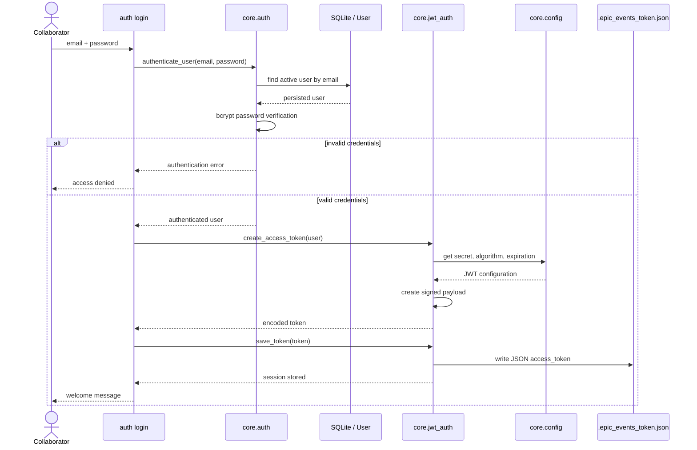
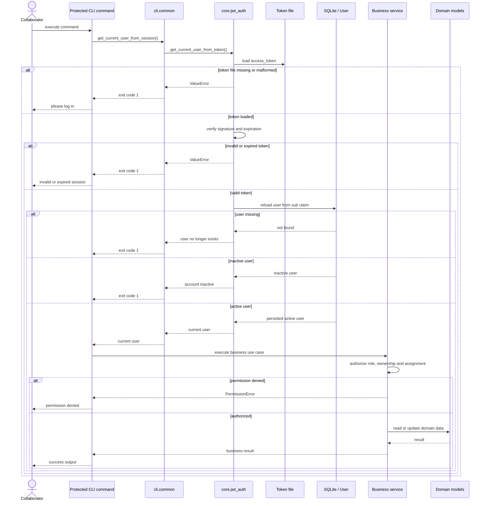
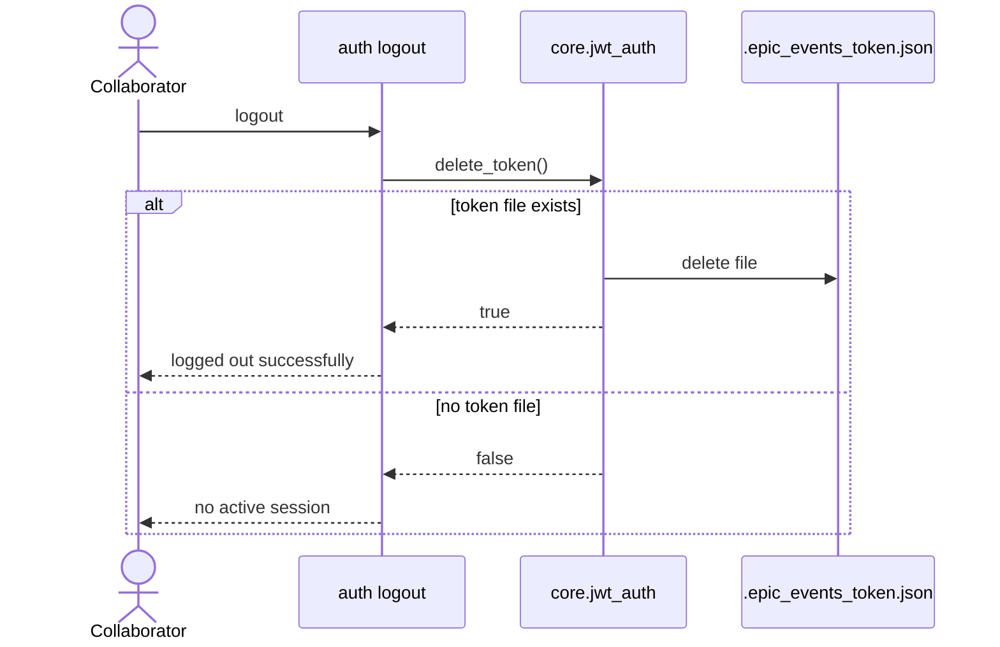
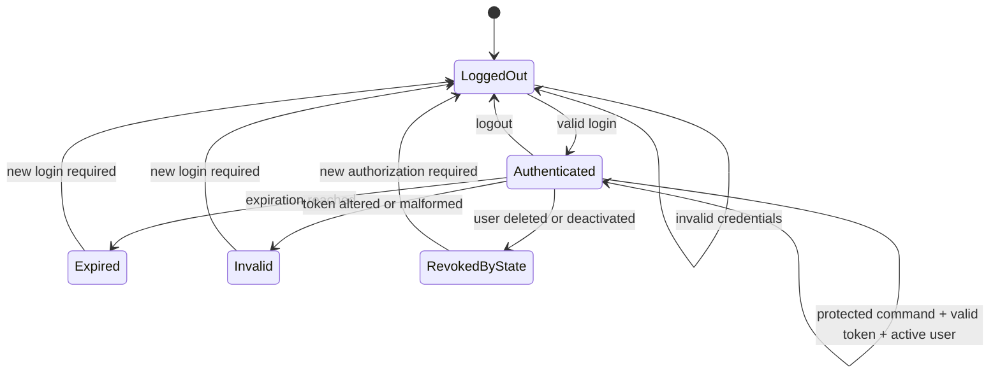
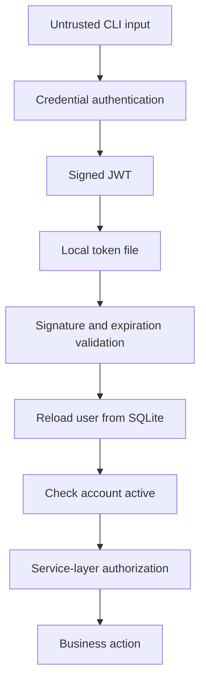
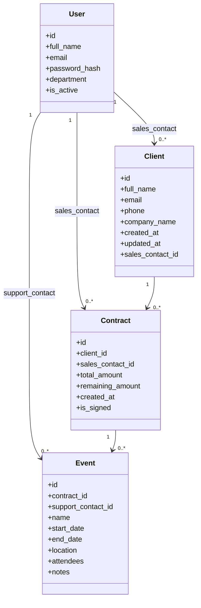

# UML v1.1 — JWT authentication architecture

## Purpose

This document describes the Epic Events architecture after introducing JWT authentication and a persistent local CLI session.

It complements the domain model by showing:

- the login flow;
- local token persistence;
- token validation;
- database-backed user resolution;
- service-layer authorization;
- logout behavior;
- failure paths.

## Version history

| Version | Main change |
|---|---|
| v0.9 | Initial CRM domain and role model |
| v1.0 | CLI package reorganization and architectural separation |
| v1.1 | JWT authentication and persistent local session |

## Component architecture



## Login sequence



## Protected command sequence



## Logout sequence



## Authentication state model



## Security boundary



The token crosses the authentication boundary but does not cross the authorization boundary by itself.

Authorization requires current persisted data and service-layer rules.

## JWT payload

```text
{
  "sub": "<user_id>",
  "email": "<user_email>",
  "department": "<user_department>",
  "iat": "<issued_at>",
  "exp": "<expiration>"
}
```

### Authoritative data

| Data | Source of truth |
|---|---|
| Token integrity | JWT signature |
| Token validity period | `iat` and `exp` |
| User identifier | `sub` claim, confirmed in SQLite |
| Account existence | SQLite |
| Account active status | SQLite |
| Current department | SQLite |
| Business permissions | Service layer |
| Ownership and assignment | Service layer and database relations |

## Domain model reminder



## Role and authorization summary

| Department | Main permissions |
|---|---|
| Management | Manage collaborators; broad access; assign responsibilities |
| Sales | Manage owned clients and contracts; create related events within authorized scope |
| Support | View assigned information; update assigned events |

The JWT does not grant these permissions directly.

Each service checks the current persisted user's department and the relevant entity relationships.

## Failure paths

The authentication layer rejects access when:

- no token file exists;
- the JSON file is corrupted;
- the `access_token` field is missing;
- the JWT format is invalid;
- the signature is invalid;
- the token is expired;
- the user identifier is invalid;
- the user no longer exists;
- the user account is inactive.

The authorization layer rejects access when:

- the authenticated department lacks the required permission;
- a sales collaborator does not own the relevant resource;
- a support collaborator is not assigned to the event;
- a protected management operation is attempted by another department.

## Test mapping

| Architecture behavior | Test coverage |
|---|---|
| Successful login and protected command | Functional CLI tests |
| Local token isolation | Autouse temporary-path fixtures |
| Complete JWT session flow | `test_jwt_complete_session_flow` |
| Missing token | `test_load_token_rejects_missing_session` |
| Invalid token | `test_decode_access_token_rejects_invalid_token` |
| Expired token | `test_decode_access_token_rejects_expired_token` |
| Inactive user | `test_get_current_user_rejects_inactive_account` |
| Deleted user | `test_get_current_user_rejects_deleted_account` |
| Corrupted JSON | `test_load_token_rejects_invalid_json_file` |
| Missing access token | `test_load_token_rejects_missing_access_token` |
| Logout without session | `test_delete_token_returns_false_when_session_is_missing` |

## Validated state

```text
156 passing tests
77% total coverage
96% coverage for src/core/jwt_auth.py
0 regressions
```

## Next architectural version

A future UML version may document:

- final README execution workflow;
- deployment or packaging choices;
- centralized logging and monitoring flow;
- any final changes made during clean-install validation.
